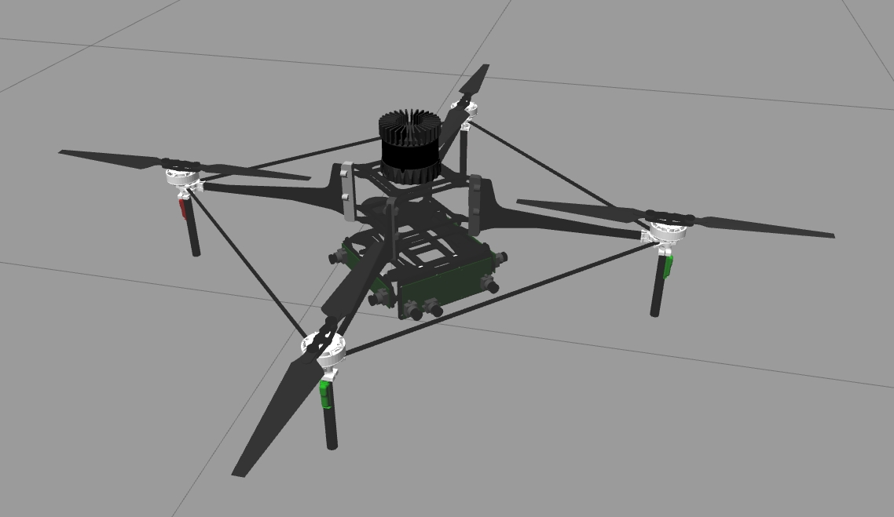
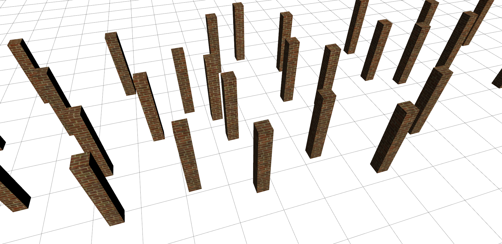
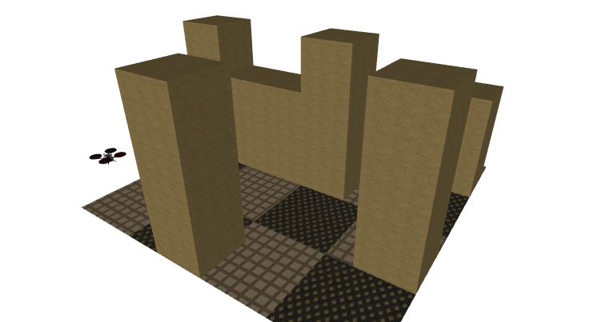
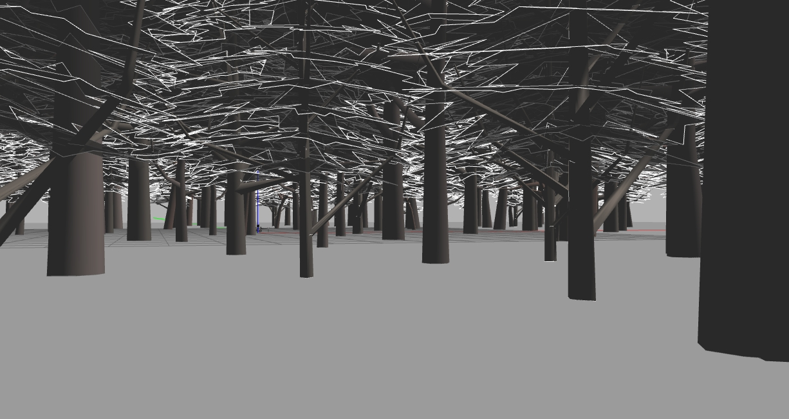

MRSL Quadrotor Simulator
=============
Package of Gazebo quadrotor simulator. Latest version works for Gazebo > 7.0.
User can easily set up the simulation environments and the quadrotor platform using sensors provided in this package.

Stacks include:
  - `mrsl_models`: all the CAD models
  - `mrsl_quadrotor_description`: all the `urdf` and world config files
  - `mrsl_quadrotor_launch`: example launch files
  - `mrsl_quadrotor_simulator`: quadrotor dynamics simulator
  - `mrsl_quadrotor_utils`: ros utils
  - `mrsl_mobile_object`: gazebo mobile obtacle plugin
  - `velodyne_simulator`: gazebo velodyne plugin
Check each package for more details.

### Requirements
Requirements
 - `ros` (indigo+)
 - `gazebo` (2.2+)
 - `gazebo_ros` (2.2+)
 - `quadrotor_control` [KumarRobotics](https://github.com/KumarRobotics/quadrotor_control)

### List of Components
  Robot Frame          |  Sensor | World | Platform Examples
  :------------------- |:-----   | :-----| :-------
  Hummingbird          |  rgbd   | empty | pelican
  Pelican              |  camera | levine| pelican\_laser
  FLA Platform         |  stereo | skir  | pelican\_laser\_rgbd
  |                    |  hokuyo | wg    | pelican\_laser\_rotate
  |                    |velodyne | pillars| pelican\_rgbd
  |                    | laser\_beam | D60| pelican\_velodyne

### Test Example
Using the example launch file in the repo
```
$cd ./mrsl_quadrotor_launch/launch
$roslaunch gazebo.launch world:=levine
$roslaunch spawn.launch robot_type:=pelican
```

### Falcon4:

 a. Sensor: OVC3, Two OVC3 side Cams, downward facing Lidar
```
$roslaunch mrsl_quadrotor_launch gazebo.launch world:=forest_Large
$roslaunch mrsl_quadrotor_launch Falcon4_spawn.launch
```
 b. Sensor: Ouster OS1 64 beam, OVC3, Two OVC3 side Cams, downward facing Lidar
```
$roslaunch mrsl_quadrotor_launch gazebo.launch world:=forest_Large
$roslaunch mrsl_quadrotor_launch Falcon4_spawn_OS1.launch
$roslaunch mav_manager example_control.launch model:=Falcon4_OS1 odom_topic:=ground_truth/odom mass:=1.88
rosrun rqt_mav_manager rqt_mav_manager
```
Simulating the Ouster OS1 64 beam lidar requires using a [fork of the ouster_example code](https://github.com/wilselby/ouster_example) 


### Samples
  hummingbird | hummingbird\_rgbd | pelican\_laser\_rgbd | Falcon4\_OS1 | mobile object
  :---------- | :-------------- | :------------------ | :----------- | :-----------
   |  |  |  | 

  levine | pillars | D60 | forest
  :---------- | :-------------- | :----------- | :-----------
   |  | 


