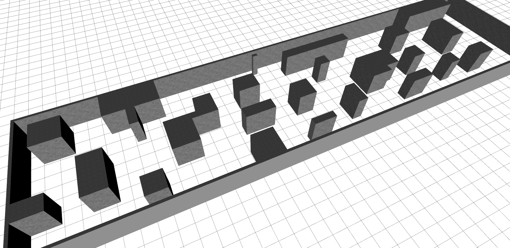

MRSL Quadrotor Simulator
=============
Package of Gazebo quadrotor simulator. User can easily set up the simulation environments and the quadrotor platform using sensors provided in this package. 

Stacks include:
  - `mrsl_models`: all the CAD models
  - `mrsl_quadrotor_description`: all the `urdf` and world config files 
  - `mrsl_quadrotor_launch`: example launch files
  - `mrsl_quadrotor_simulator`: quadrotor dynamics simulator
  - `mrsl_quadrotor_utils`: ros utils
  - `mrsl_mobile_object`: gazebo mobile obtacle plugin
  - `velodyne_simulator`: gazebo velodyne plugin
Check each package for more details.
  
### Requirements
Requirements
 - `ros` (indigo+)
 - `gazebo` (2.2+)
 - `gazebo_ros` (2.2+)
 - `quadrotor_control` [KumarRobotics](https://github.com/KumarRobotics/quadrotor_control)

### List of Components
  Robot Frame          | Mobile object | Sensor | World
  :------------------- | :------------ | :----- | :------
  Hummingbird          | mobile object | rgbd   | empty
  Pelican              | laser_rotate  | monocular  | levine
  Fla Platform         |               | stereo | skir
  |                    |               | hokuyo | wg
  |                    |               | velodyne | fla_warehouse
  |                    |               |        | fla_forest

### Test Example 
Using the example launch file in the repo
```
$cd ./mrsl_quadrotor_launch/launch
$roslaunch gazebo.launch world:=levine
$roslaunch spawn.launch robot_type:=pelican
```

### Samples
  hummingbird | hummingbird_rgbd | pelican_laser_rgbd | mobile object
  :---------- | :-------------- | :------------------ | :-----------
   |  |  | 

  levine | pillars | iros2017_corridor
  :---------- | :-------------- | :-----------
   |  | 


