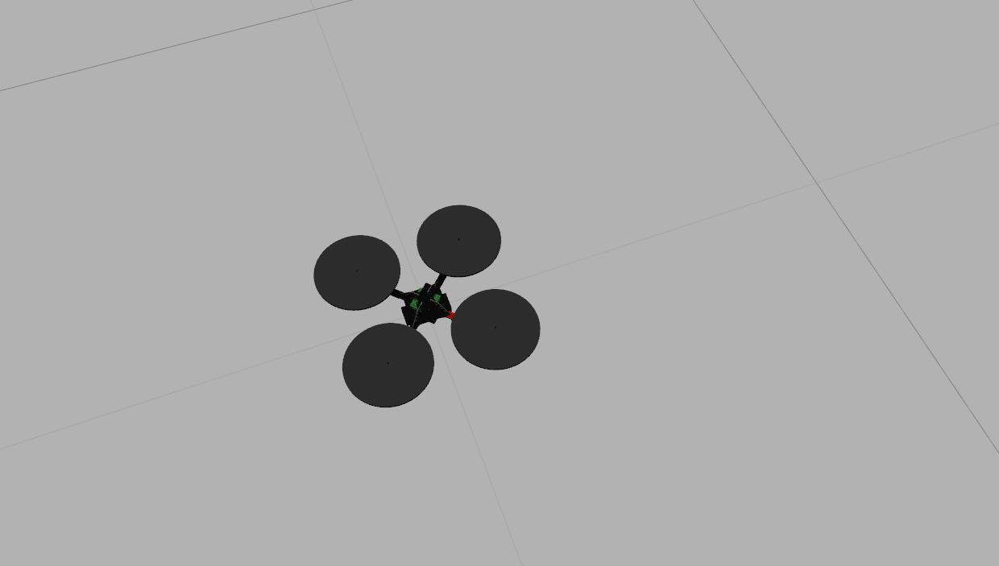
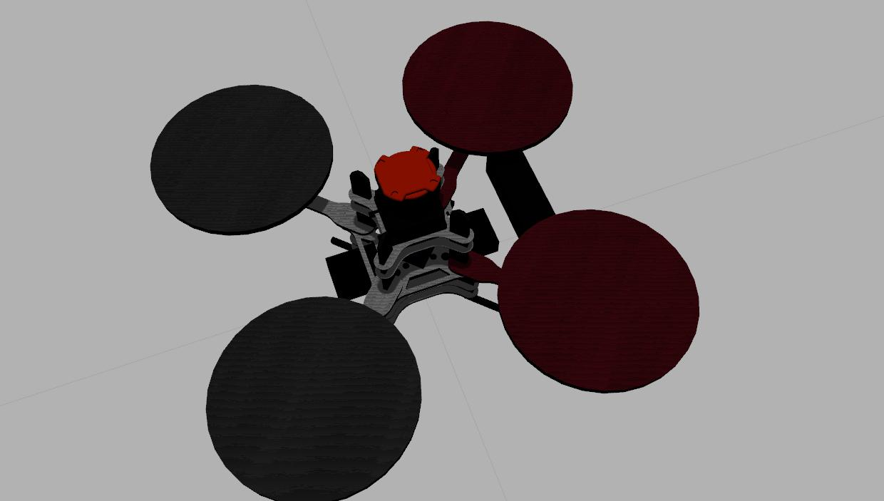
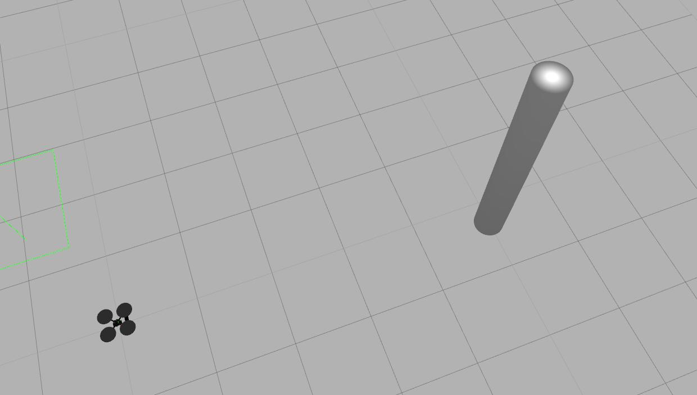
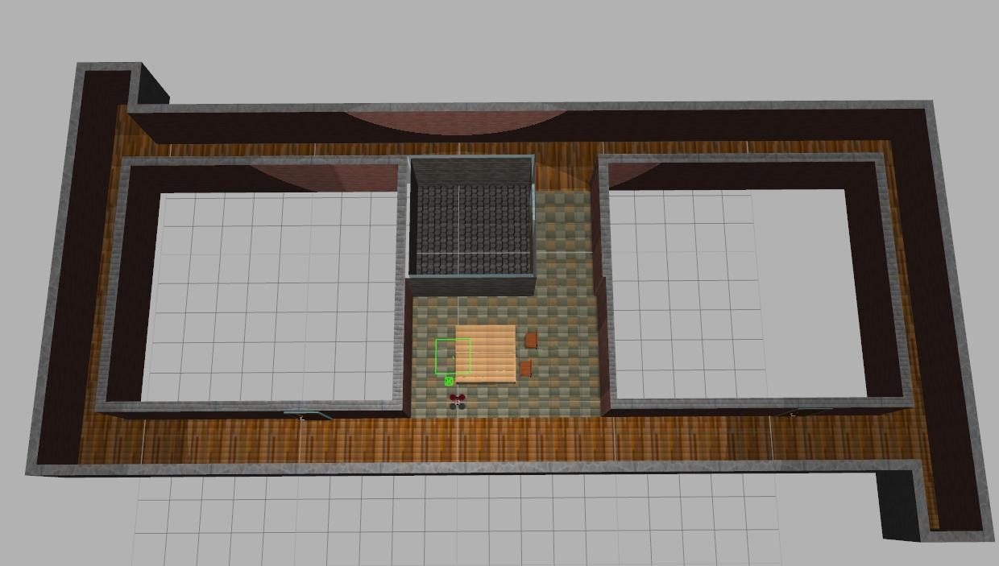
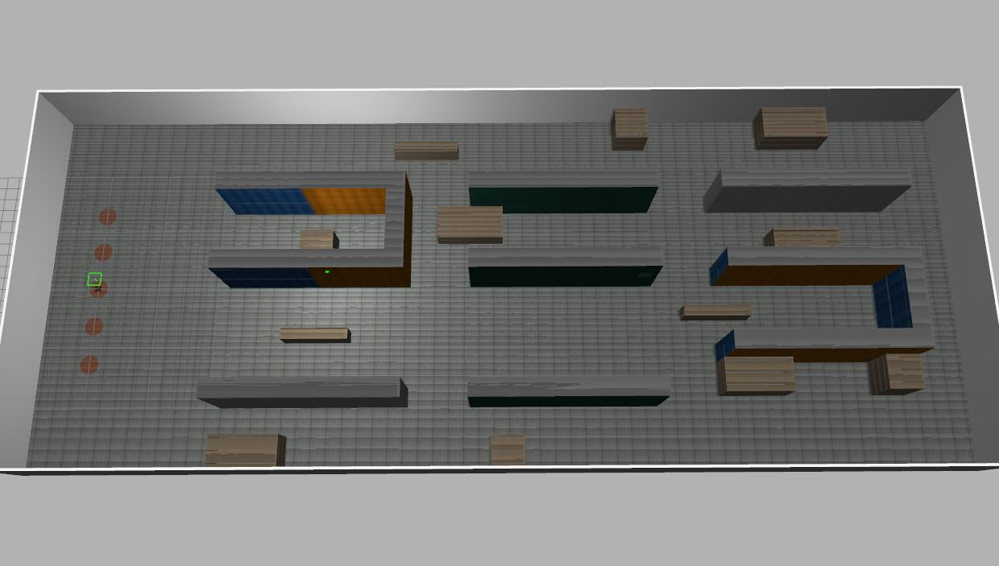

mrsl_quadrotor
==========
package of simulation for mrsl UAV
### Requirements
General Requirements
 - `ros` (indigo)
 - `gazebo` (2.2)
 - `gazebo_ros` (2.2)

### List
  Robot Type         | Mobile object | Sensor | World    
  :----------------- | :------------ | :----- | :------
  hummingbird        | mobile object | rgbd   | empty    
  hummingbird_rgbd   |               | laser  | levine   
  pelican_laser_rgbd |               |        | corridor 
                     |               |        | warehouse

### mrsl_quadrotor_launch
the package for launch demo
```           
$cd ./launch
$roslaunch gazebo.launch world:=corridor
$roslaunch spawn.launch robot_type:=pelican_laser_rgbd
```
 
### Samples
  hummingbird | hummingbird_rgbd | pelican_laser_rgbd | mobile object
  :---------- | :-------------- | :----------------- | :-----------
   |  |  | 

  levine | corridor | warehouse 
  :---------- | :-------------- | :----------- 
   |  | 


